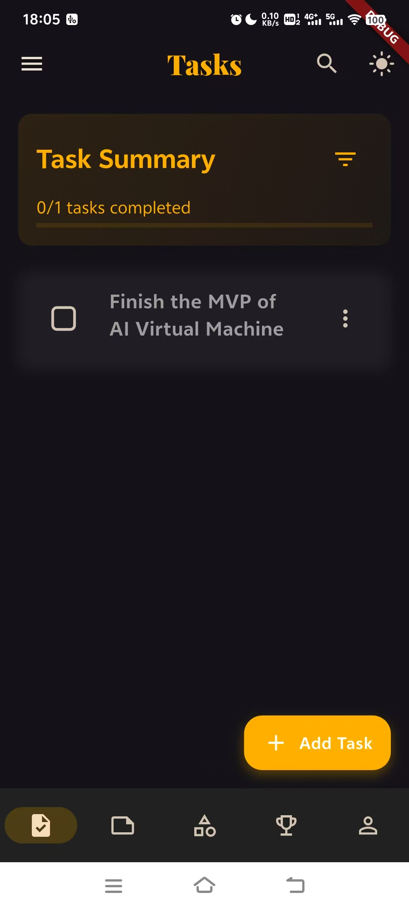
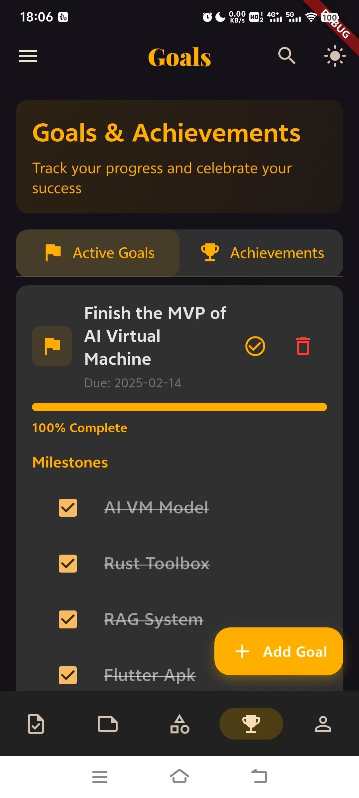
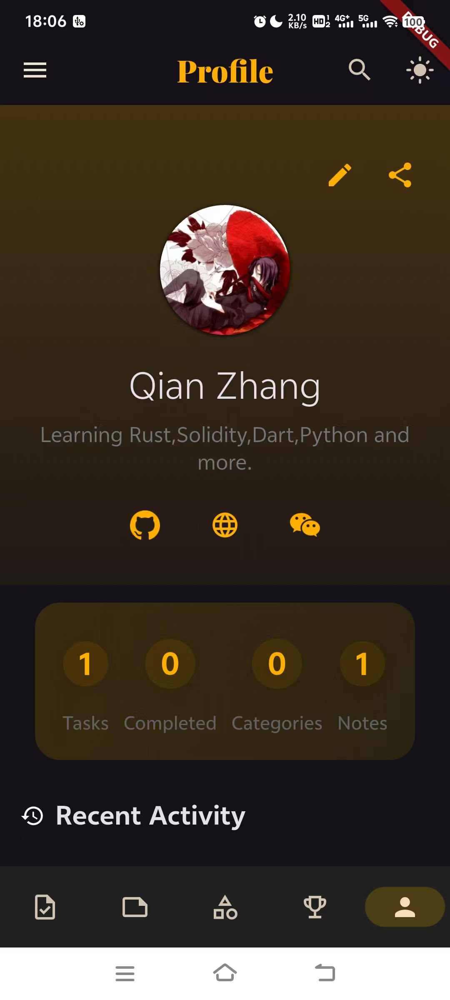
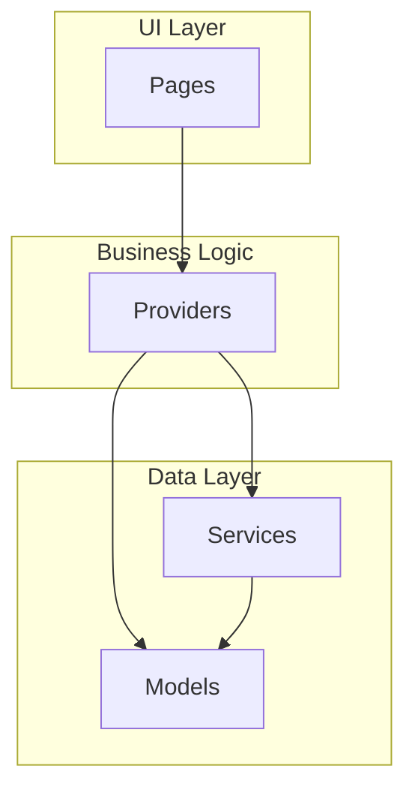
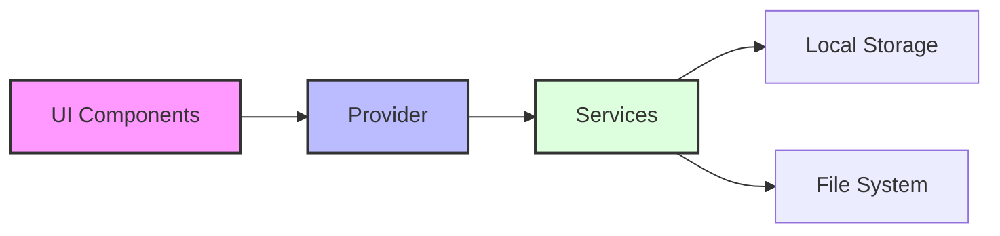

# 📱 Organizer - Flutter Example Project

> 🎯 A modern, feature-rich Flutter application showcasing clean architecture, state management best practices, and beautiful Material Design. Perfect for learning Flutter development through a real-world, production-quality example.

## 🖼️ Screenshots

<div align="center">
  <table>
    <tr>
      <td align="center"><b>Tasks View</b></td>
      <td align="center"><b>Goals View</b></td>
      <td align="center"><b>Profile View</b></td>
    </tr>
    <tr>
      <td></td>
      <td></td>
      <td></td>
    </tr>
  </table>
</div>

## ✨ Features

- **📋 Task Management**
  - ✅ Create, edit, and delete tasks
  - ⏰ Set due dates and priorities
  - 📊 Track progress
  - 🏷️ Organize with categories and tags
  - ✓ Mark tasks as completed

- **📝 Note Taking**
  - 📖 Rich text editor
  - 🎨 Color customization
  - 📱 Grid/List view toggle
  - 🔍 Search and filter
  - 📤 Share functionality

- **🎯 Goal Tracking**
  - 🚀 Set and track goals
  - 📈 Progress monitoring
  - 🏆 Achievement system
  - 📅 Milestone tracking
  - 🔄 Convert goals to achievements

- **👤 Profile Management**
  - 🌓 Dark/Light theme
  - 📊 Activity statistics
  - ⭐ Favorite categories
  - 🎨 UI customization

## 🎓 Learning Points

This project demonstrates:
- 🏗️ Clean Architecture in Flutter
- 🔄 State Management with Provider
- 💾 Local Data Persistence
- 🎨 Modern UI/UX Design
- 🧪 Code Organization
- 📱 Responsive Design

## 🏗️ Architecture

This project follows a clean, maintainable architecture that separates concerns and promotes scalability:



### 📦 Core Components

```
lib/
├── models/           # Data structures
│   ├── task.dart     # Task model
│   ├── note.dart     # Note model
│   ├── goal.dart     # Goal model
│   └── profile.dart  # User profile model
│
├── providers/        # State management
│   ├── task_provider.dart    # Task state & logic
│   ├── note_provider.dart    # Note state & logic
│   ├── goal_provider.dart    # Goal state & logic
│   └── theme_provider.dart   # Theme state & logic
│
├── pages/           # UI screens
│   ├── tasks_page.dart      # Task management
│   ├── notes_page.dart      # Note management
│   ├── goals_page.dart      # Goal tracking
│   └── profile_page.dart    # User profile
│
├── services/        # Business logic & data handling
│   ├── storage_service.dart # Data persistence
│   └── file_service.dart    # File operations
│
└── main.dart        # App entry point & configuration
```

### 🔄 Data Flow

1. **UI Layer (Pages)**
   - Handles user interactions
   - Displays data using widgets
   - Communicates with Providers

2. **State Management (Providers)**
   - Manages application state
   - Handles business logic
   - Coordinates between UI and Services

3. **Services Layer**
   - Handles data persistence
   - Manages file operations
   - Implements business rules

4. **Data Layer (Models)**
   - Defines data structures
   - Implements data validation
   - Handles data serialization

### 🔌 Dependencies



### 🔒 State Management

The app uses Provider pattern for state management:
- Centralized state handling
- Reactive UI updates
- Efficient data propagation
- Clean separation of concerns

## 🚀 Getting Started

### 📋 Prerequisites

- 📱 Flutter SDK (>=3.0.0)
- ☕ Dart SDK (>=3.0.0)

### ⚙️ Installation

1. Clone the repo:
```bash
git clone git@github.com:HappyFox001/organizer.git
```

2. Get packages:
```bash
flutter pub get
```

3. Run the app:
```bash
flutter run
```

## 🛠️ Built With

- 📱 Flutter - UI Framework
- 🔄 Provider - State Management
- 💾 Shared Preferences - Local Storage
- 🎨 Google Fonts - Typography
- 📸 Image Picker - Media Selection
- 🔗 URL Launcher - External Links

## 📂 Project Structure

```
lib/
├── models/        # 📦 Data models
├── providers/     # 🔄 State management
├── pages/         # 📱 UI screens
├── services/      # 🔧 Business logic
└── widgets/       # 🧩 Reusable components
```

## 🤝 Contributing

1. 🍴 Fork the Project
2. 🔧 Create your Feature Branch
3. 💾 Commit your Changes
4. 📤 Push to the Branch
5. 🔀 Open a Pull Request

## 📝 License

MIT License - feel free to use this project as a template! 🎉

## 👨‍💻 Author

© 2025 Qian Zhang

## 🙏 Acknowledgments

- 💙 Flutter Team
- 👥 Open Source Community
- 🌟 All Contributors

---
<div align="center">
  <strong>Happy Coding! 💻</strong>
</div>
